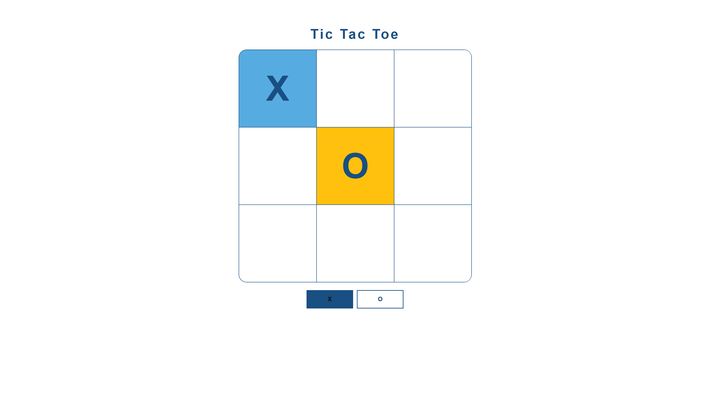

# ❌⭕ Tic Tac Toe

A simple and clean browser-based Tic Tac Toe game for two players. Includes sound effects, animated UI, and custom cursor styling.

**🔗 Live Demo**: [Tic Tac Toe](https://dobbyssockk.github.io/tic-tac-toe/)

---

## 🚀 Features

- Classic two-player Tic Tac Toe gameplay
- Turn-based interaction with visual indicators
- Winning condition logic and game reset
- Click sound feedback on move (pencil sound)
- Custom cursor and minimalist design

---

## 🛠️ Technologies Used

- **HTML5** – semantic markup for layout
- **CSS3** – styling, grid layout, responsive design
- **JavaScript (Vanilla)** – game logic, turn handling, event listeners
- **Audio** – feedback sound for user interaction

---

## 💡 Key Concepts

- **Game state management**: 1D array for board tracking and win checking
- **DOM manipulation**: dynamic update of board cells and turn indicators
- **Event-driven architecture**: listen for user clicks to drive gameplay
- **Responsive design**: scalable layout using CSS grid
- **User experience**: subtle feedback through animation and sound
